# multi-agent

A modular, pattern-based multi-agent orchestration framework. Implements 5 pluggable architecture patterns, 6 standalone features, and 2 protocol integrations over a shared event-sourced core.

---

## Architecture Overview

```
┌─────────────────────────────────────────────────────────────────────────┐
│                           PATTERNS LAYER                                │
│                                                                         │
│  ┌─────────┐  ┌─────────────┐  ┌───────────────────┐  ┌────────────┐  │
│  │  ReAct   │  │Plan & Execute│  │Orchestrator-Workers│  │ Hierarchical│  │
│  └────┬────┘  └──────┬──────┘  └─────────┬─────────┘  └──────┬─────┘  │
│       │              │                   │                   │         │
│  ┌────┴────┐  ┌──────┴──────┐           │                   │         │
│  │  Swarm  │  │  (handoff)  │           │                   │         │
│  └─────────┘  └─────────────┘           │                   │         │
├─────────────────────────────────────────┼───────────────────┼─────────┤
│                           FEATURES LAYER │                   │         │
│                                         │                   │         │
│  ┌──────────┐ ┌────────┐ ┌───────────┐ │                   │         │
│  │ CodeAct  │ │ Browser│ │Permissions │ │                   │         │
│  └────┬─────┘ └───┬────┘ └─────┬─────┘ │                   │         │
│       │           │            │       │                   │         │
│  ┌────┴─────┐ ┌───┴────┐ ┌────┴──────┐ │                   │         │
│  │ Memory   │ │Observe │ │ Durable   │ │                   │         │
│  └──────────┘ └────────┘ └───────────┘ │                   │         │
├─────────────────────────────────────────┼───────────────────┼─────────┤
│                     INTEGRATIONS LAYER  │                   │         │
│                                         │                   │         │
│        ┌─────────────────┐   ┌─────────────────────┐       │         │
│        │   MCP Client    │   │    A2A Client       │       │         │
│        │ (tool ecosystem)│   │ (agent-to-agent)    │       │         │
│        └────────┬────────┘   └──────────┬──────────┘       │         │
├─────────────────┼───────────────────────┼──────────────────┼─────────┤
│                 │        CORE LAYER     │                  │         │
│                 │                       │                  │         │
│  ┌──────┐ ┌────┴────┐ ┌──────┐ ┌───────┴────┐ ┌────────┐ │         │
│  │Event │ │ Thread  │ │ Tool │ │   Agent    │ │  LLM   │ │         │
│  └──────┘ └─────────┘ └──────┘ └────────────┘ └────────┘ │         │
│  ┌───────────┐ ┌──────────────┐ ┌──────────────┐         │         │
│  │ThreadStore│ │  Permissions │ │   Context    │         │         │
│  └───────────┘ └──────────────┘ └──────────────┘         │         │
└──────────────────────────────────────────────────────────┘─────────┘
```

### Layer Responsibilities

| Layer | What It Does | Key Principle |
|-------|-------------|---------------|
| **Core** | Shared types all layers depend on | Zero external deps (only pydantic) |
| **Integrations** | Protocol adapters for MCP + A2A | Each works independently |
| **Features** | Standalone capabilities usable anywhere | No dependency on patterns |
| **Patterns** | Orchestration flows that combine agents | Same core types work in all patterns |

---

## Core Layer

The foundation. Every module in the framework depends on these types.

### Event

The atomic unit — a diary entry for everything that happens.

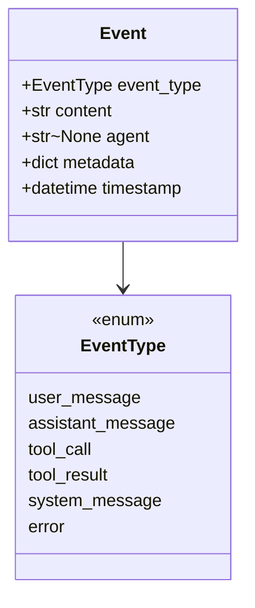

### Thread

An append-only sequence of Events. The universal state container.

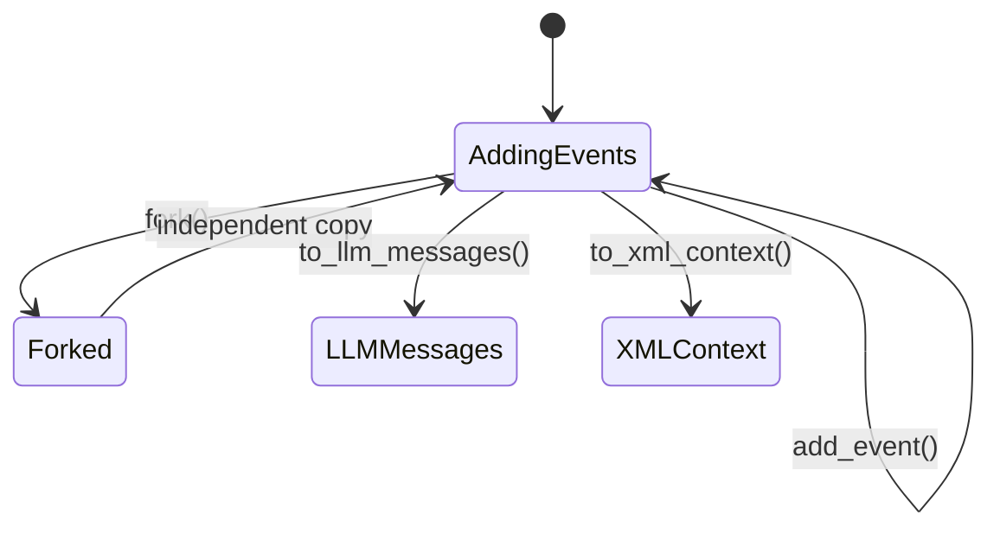

```python
thread = Thread()
thread.add_event(Event(event_type=EventType.user_message, content="hello"))
thread.add_event(Event(event_type=EventType.assistant_message, content="hi"))
messages = thread.to_llm_messages()  # → OpenAI-compatible format
forked = thread.fork()                # → deep copy for branching
```

### Tool

A callable with a JSON Schema signature and a permission level.

```python
async def search_fn(query: str) -> ToolResult:
    return ToolResult(success=True, output=f"results for {query}")

tool = Tool(
    name="search",
    description="Search the web",
    parameters={"type": "object", "properties": {"query": {"type": "string"}}},
    function=search_fn,
    permission=PermissionLevel.ask,  # allow | deny | ask | bubble
)
```

### Agent

An agent configuration — personality, tools, and model.

```python
agent = Agent(
    name="researcher",
    system_prompt="You are a research assistant.",
    tools=[search_tool, code_tool],
    model="gpt-4o",
    max_turns=15,
)
```

### ThreadStore

Abstract persistence for threads.

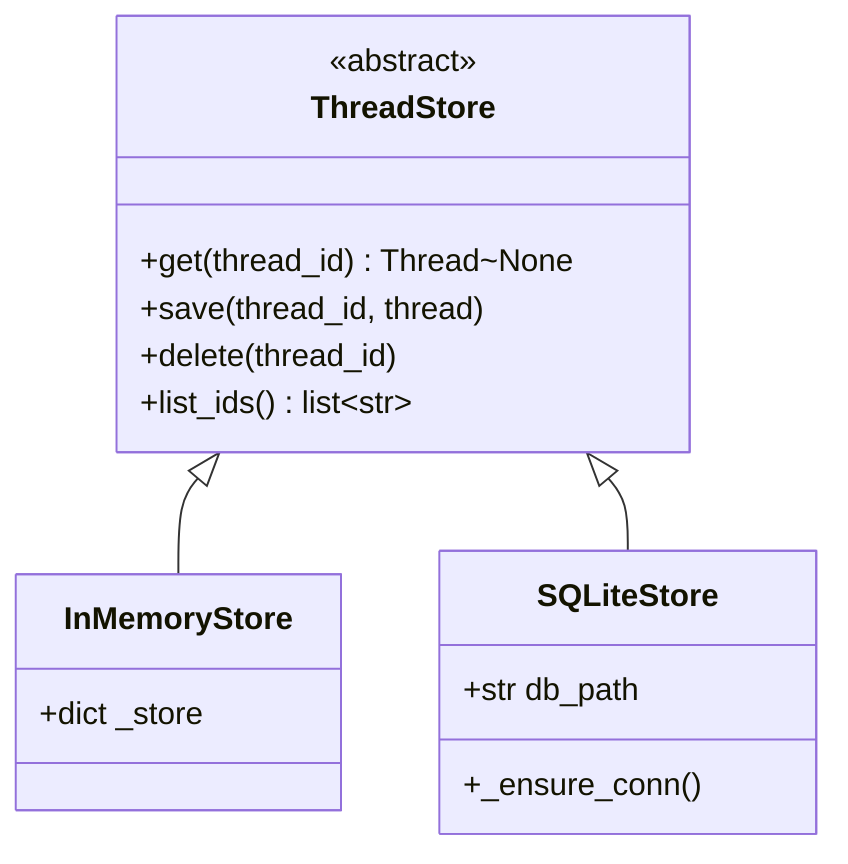

---

## Patterns Layer

All patterns share the same contract: take agents + a task, produce a Thread.

### 1. ReAct

The foundation pattern. Single agent Think-Act-Observe loop with CodeAct as the default action mechanism and JSON tool calls as fallback.

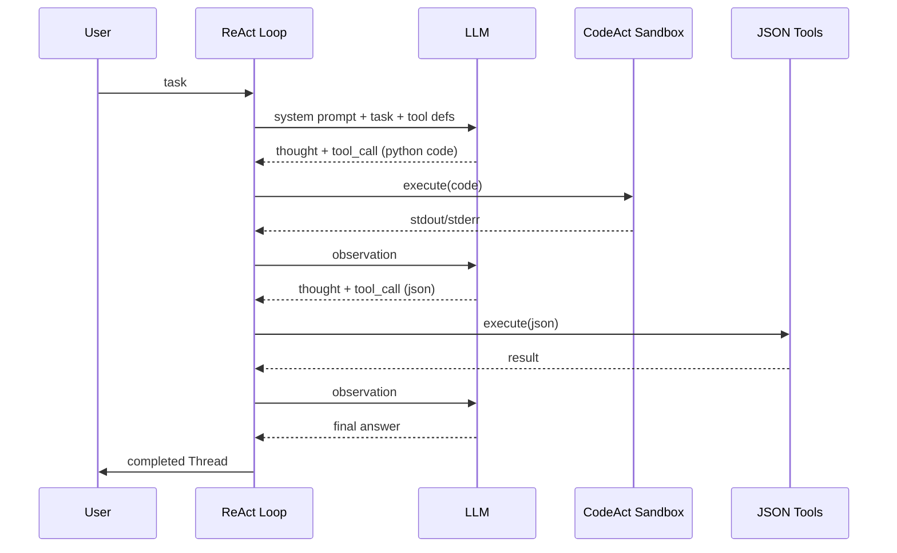

```python
from multi_agent.patterns.react import react

thread = await react(
    task="Calculate 15 * 37",
    agent=Agent(name="assistant", model="groq/llama-4-scout-17b-16e-instruct"),
)
```

| Property | Value |
|----------|-------|
| Agents | Single agent |
| AI Calls | Sequential |
| Best for | Simple tool-use tasks |
| Max turns | Configurable (default 25) |
| Action mechanism | CodeAct (python) > JSON tools |

---

### 2. Plan & Execute

Planner (strong model) decomposes the task → Executor (cheaper model) runs each step → Replanner adjusts course based on results.

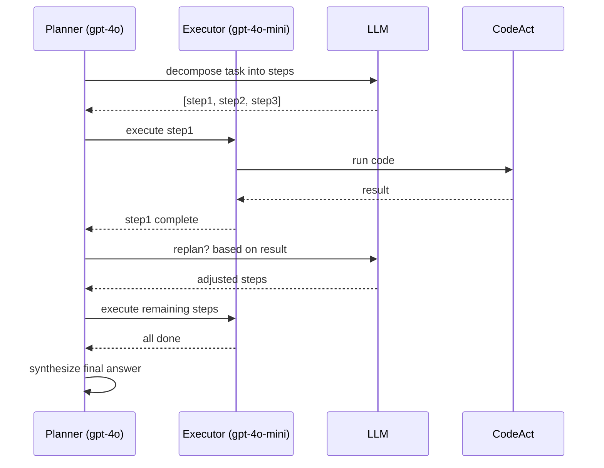

```python
from multi_agent.patterns.plan_execute import plan_and_execute

thread = await plan_and_execute(
    task="Build a web scraper that extracts all links from a page",
    planner_agent=Agent(name="planner", model="gpt-4o"),
    executor_agent=Agent(name="executor", model="gpt-4o-mini"),
)
```

| Property | Value |
|----------|-------|
| Agents | 2 (Planner + Executor) or same |
| AI Calls | Planner → Executor × steps → Replanner |
| Best for | Multi-step tasks, research, code generation |
| Max iterations | Configurable (default 3 replan cycles) |

---

### 3. Orchestrator-Workers (Fan-Out)

Orchestrator splits task → N workers run in parallel → Synthesizer combines results. Inspired by Manus Clone Fan-Out for wide research.

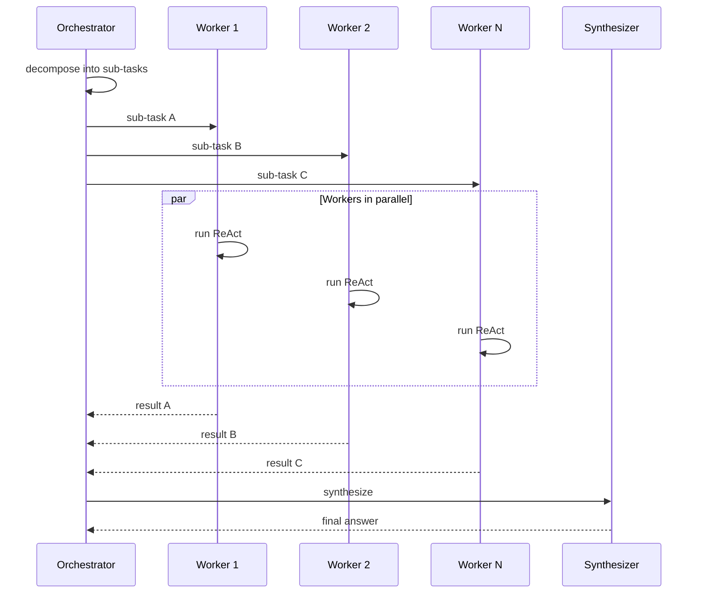

```python
from multi_agent.patterns.orchestrator_workers import orchestrator_workers

thread = await orchestrator_workers(
    task="Research the top 5 AI frameworks in 2026",
    num_workers=5,
)
```

| Property | Value |
|----------|-------|
| Agents | 1 Orchestrator + N Workers (any count) |
| AI Calls | Parallel × N + synthesize |
| Best for | Parallel research, data processing, wide exploration |
| Parallelism | asyncio.gather — true concurrent LLM calls |

---

### 4. Hierarchical (Supervisor)

Supervisor delegates to specialized workers (Researcher, Coder, etc.) and synthesizes their results. Each worker is an independent Agent with its own system prompt.

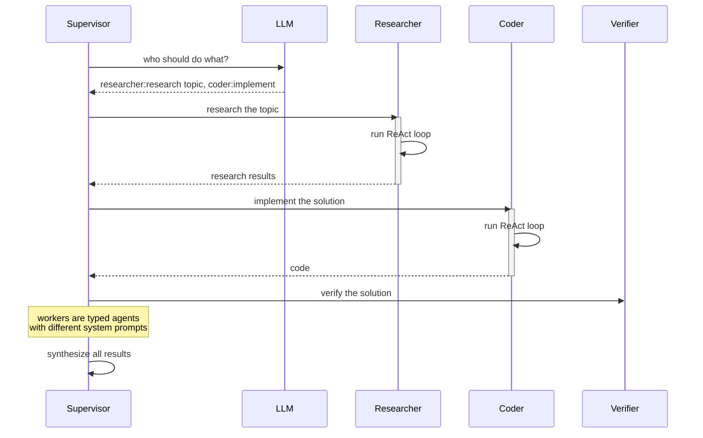

```python
from multi_agent.patterns.hierarchical import hierarchical

thread = await hierarchical(
    task="Create a Python CLI tool",
    supervisor_agent=Agent(name="supervisor", model="gpt-4o"),
    workers=[
        Agent(name="researcher", model="gpt-4o-mini", system_prompt="Research best practices"),
        Agent(name="coder", model="gpt-4o-mini", system_prompt="Write clean Python code"),
        Agent(name="verifier", model="gpt-4o-mini", system_prompt="Check for bugs"),
    ],
)
```

| Property | Value |
|----------|-------|
| Agents | 1 Supervisor + N typed Workers |
| AI Calls | Sequential (each worker runs its own ReAct) |
| Best for | Multi-skill tasks needing specialized sub-agents |
| Worker type | Each worker has its own system prompt + tools |

---

### 5. Swarm (Handoff)

Triage agent routes the task → Specialist handles it → Decides to hand off or finish. Inspired by OpenAI Agents SDK handoff pattern.

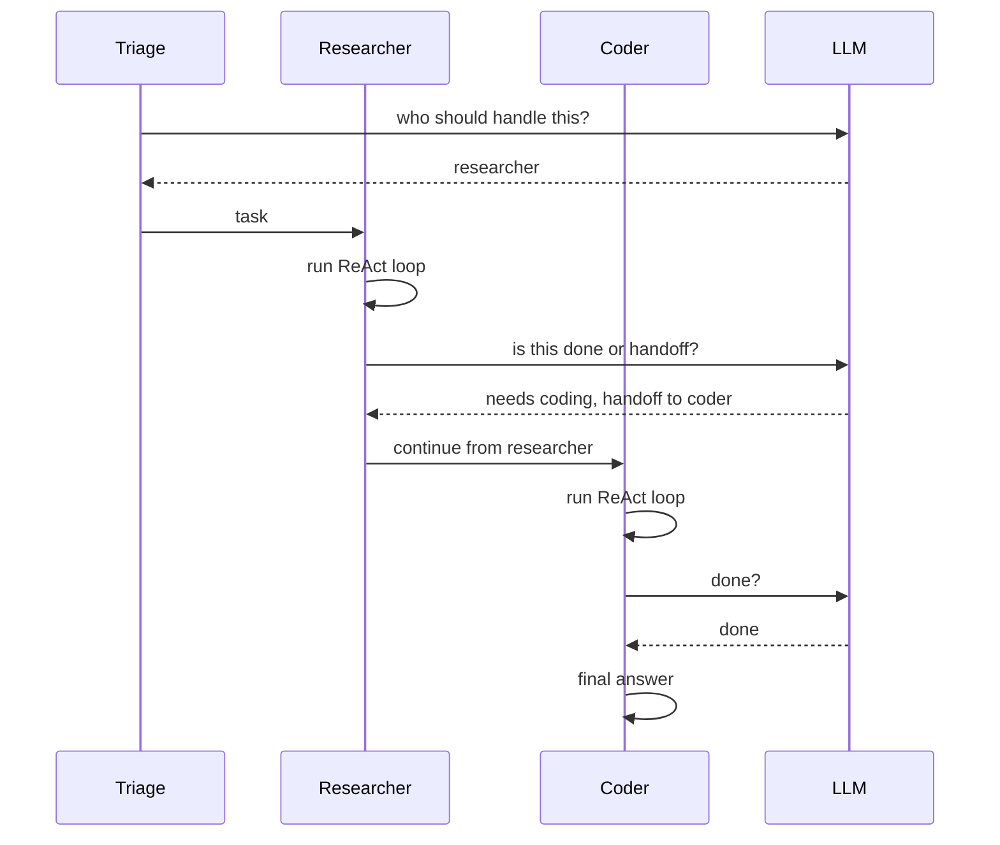

```python
from multi_agent.patterns.swarm import swarm

thread = await swarm(
    task="Research and implement a bisect algorithm",
    agents=[
        Agent(name="triage", system_prompt="Route tasks", max_turns=1),
        Agent(name="researcher", system_prompt="Research algorithms"),
        Agent(name="coder", system_prompt="Write Python code"),
    ],
)
```

| Property | Value |
|----------|-------|
| Agents | N agents with handoff routing |
| AI Calls | Sequential with handoff decisions |
| Best for | Customer support, multi-domain queries |
| Max handoffs | Configurable (default 5) |

---

### Pattern Comparison

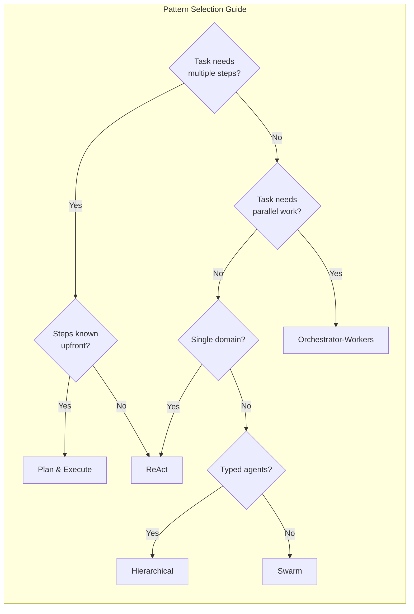

| Pattern | When To Use | When NOT To Use |
|---------|------------|-----------------|
| **ReAct** | Simple tool use, ≤10 steps, single agent | Multi-hour tasks, complex multi-agent coordination |
| **Plan & Execute** | Research, multi-step coding, unknown terrain | Very simple tasks (ReAct is faster) |
| **Orchestrator-Workers** | Parallel research, bulk data processing | Sequential tasks (adds overhead) |
| **Hierarchical** | Need typed specialists, different models per role | Simple routing (Swarm is lighter) |
| **Swarm** | Customer support routing, multi-domain queries | Deep tree of sub-tasks (Hierarchical better) |

---

## Features Layer

Standalone capabilities that any pattern (or any external code) can use.

### CodeAct

Python code execution in a restricted sandbox. Primary action mechanism for all patterns — ~30% fewer steps than JSON-only tool calling.

```python
from multi_agent.features.codeact import CodeActSandbox

sandbox = CodeActSandbox()
result = await sandbox.run("""
import math
print(math.factorial(10))
""")
print(result.output)  # → 3628800
```

Security model:
- `allow_imports=False` (default): Import statements are blocked
- `allow_imports=True` + `allowed_modules=["math"]`: Only listed modules can be imported
- `exec()` in restricted namespace with limited builtins
- `reset()` clears namespace between runs

### Browser

Playwright-based web browsing with DOM tree extraction and element index interaction. Follows the browser-use approach.

```mermaid
graph LR
    A[Agent] -->|browser_navigate| B[Playwright]
    B -->|extract DOM| C[Semantic Tree]
    C -->|numbered elements| A
    A -->|browser_click 5| B
    A -->|browser_type 3 "query"| B
    A -->|browser_screenshot| B
    B -->|screenshot b64| A
```

```python
from multi_agent.features.browser import BrowserTool

browser = BrowserTool(headless=True)
result = await browser.navigate("https://example.com")
print(result["title"])       # → "Example Domain"
print(result["elements"])    # → 6
print(result["page"][:200])  # → "[0] <body>Example Domain..."
```

5 browser tools exposed to agents:

| Tool | Permission | Purpose |
|------|-----------|---------|
| `browser_navigate` | allow | Go to a URL, returns page tree |
| `browser_click` | ask | Click element by index |
| `browser_type` | ask | Type text into input by index |
| `browser_scroll` | allow | Scroll up/down |
| `browser_screenshot` | allow | Return base64 screenshot |

### Permissions

Human-in-the-loop for dangerous operations. Four levels per tool.

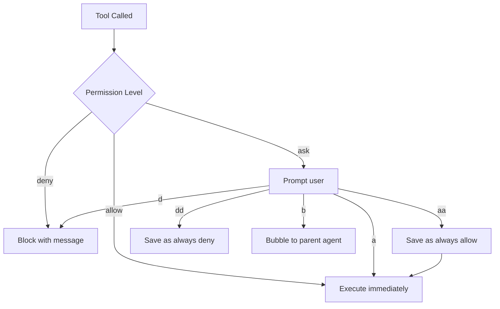

```python
from multi_agent.features.permissions import PermissionConfig, PermissionCLI

config = PermissionConfig(rules=[
    Rule(pattern="*", permission=PermissionLevel.allow),
    Rule(pattern="browser_click", permission=PermissionLevel.ask),
    Rule(pattern="rm", permission=PermissionLevel.deny),
])
config.save()  # persists to .permissions.json

cli = PermissionCLI(config)
tool.permission = PermissionLevel.ask
wrapped = await cli.wrap_tool(tool)
```

### Memory

Plug in different memory backends. Adapter pattern — swap implementations without changing code.

```python
from multi_agent.features.memory import InMemoryMemory, Mem0Memory

# Development
memory = InMemoryMemory()

# Production with Mem0 (open-source)
memory = Mem0Memory(api_key="...")

await memory.store("user1", "prefers Python over JavaScript")
results = await memory.search("Python")
```

| Adapter | License | Storage | Best For |
|---------|---------|---------|----------|
| `InMemoryMemory` | MIT | Dict in RAM | Development, testing |
| `Mem0Memory` | MIT | Mem0 cloud/server | Production memory |
| *(future) Letta* | Apache 2.0 | Self-managed DB | Long-term persistent memory |
| *(future) Zep* | Apache 2.0 | Temporal graph | Time-based retrieval |

### Observability

OpenTelemetry-inspired tracing with span export.

```python
from multi_agent.features.observability import OTelTracer, ConsoleExporter

tracer = OTelTracer(service_name="my-agent")
tracer.add_exporter(ConsoleExporter())

async with tracer.span("llm_call", {"model": "gpt-4o"}):
    result = await llm.chat(...)
    span.add_event("tool_call", {"tool": "python"})

tracer.export()
# → === TRACE (2 spans) ===
# →   llm_call: 1240ms (1 events)
```

### Durable Execution

Persist and resume long-running agent executions.

```python
from multi_agent.features.durable import InMemoryExecutor

async def my_long_step() -> str:
    # ... many LLM calls ...
    return "done"

executor = InMemoryExecutor(persist_path="executions.json")
execution = await executor.run(my_long_step)
print(execution.status)  # → "completed"
print(execution.id)      # → "uuid"
```

---

## Integrations Layer

### MCP (Model Context Protocol)

Consume tools from any MCP server — 2,300+ available in the ecosystem.

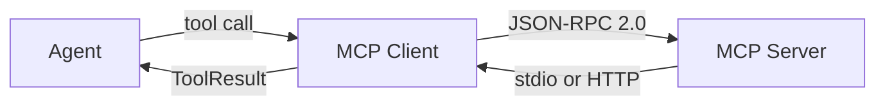

```python
from multi_agent.integrations.mcp import MCPClient

mcp = MCPClient(command="npx @anthropic/mcp-filesystem-server /path")
await mcp.connect()
print(mcp.tools)  # → [Tool("read_file"), Tool("write_file"), ...]
```

- Stdio transport for local MCP servers
- HTTP/Streamable HTTP for remote servers
- Tools surfaced as standard `Tool` objects (permission = `ask` by default)

### A2A (Agent-to-Agent Protocol)

Interact with remote agents via the Agent-to-Agent protocol (v1.0.0, May 2026).

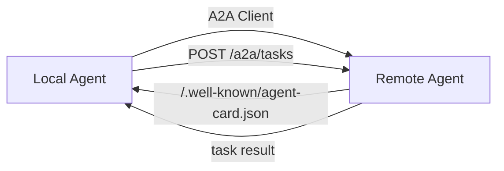

```python
from multi_agent.integrations.a2a import A2AClient, AgentCard
from multi_agent.integrations.a2a.server import A2AServer

# Client
client = A2AClient("http://remote-agent:8080")
card = await client.get_card()
result = await client.send_task("research quantum computing")

# Server
async def handler(task, metadata):
    return f"Processed: {task}"

server = A2AServer(
    AgentCard(name="my-agent", skills=["research", "code"]),
    handler=handler,
)
card_dict = server.get_card_dict()
task_result = await server.handle_task({"task": "analyze data"})
```

---

## File Tree

```
multi_agent/
├── __init__.py
│
├── core/                          # Shared foundation (zero hard deps)
│   ├── event.py                   # Event, EventType
│   ├── thread.py                  # Thread — append-only event sequence
│   ├── tool.py                    # Tool, PermissionLevel, ToolResult
│   ├── agent.py                   # Agent — name, prompt, tools, model
│   ├── llm.py                     # LLMClient ABC + LiteLLMClient
│   ├── store.py                   # ThreadStore ABC + InMemory + SQLite
│   └── context.py                 # XML/Markdown formatters
│
├── patterns/                      # Orchestration flows
│   ├── react.py                   # Single agent think-act-observe
│   ├── plan_execute.py            # Planner → Executor → Replanner
│   ├── orchestrator_workers.py    # Fan-out/fan-in with asyncio.gather
│   ├── hierarchical.py            # Supervisor → typed workers
│   └── swarm.py                   # Triage → handoff → specialist
│
├── features/                      # Standalone capabilities
│   ├── codeact/
│   │   └── sandbox.py             # Python exec sandbox
│   ├── browser/
│   │   └── browser.py             # Playwright DOM tree + element indices
│   ├── permissions/
│   │   ├── config.py              # Rule-based permission config
│   │   └── cli.py                 # Interactive allow/deny/ask CLI
│   ├── memory/
│   │   └── adapters.py            # InMemory + Mem0 adapters
│   ├── observability/
│   │   └── tracer.py              # OTel-style spans + exporters
│   └── durable/
│       └── executor.py            # Execution persistence
│
├── integrations/                  # Protocol adapters
│   ├── mcp/
│   │   └── client.py              # MCP stdio + HTTP client
│   └── a2a/
│       ├── card.py                # Agent Card model
│       ├── client.py              # A2A task client
│       └── server.py              # A2A task server
│
├── opencode.json                  # Plugin configuration
├── pyproject.toml                 # Package config
└── README.md
```

---

## Quick Start

```bash
pip install -e ".[dev]"
```

```python
import asyncio
from multi_agent.core.agent import Agent
from multi_agent.patterns.react import react

async def main():
    thread = await react(
        task="Calculate 15 * 37 and print the answer.",
        agent=Agent(
            name="assistant",
            model="groq/meta-llama/llama-4-scout-17b-16e-instruct",
            system_prompt="You are helpful. Use python tool for math.",
        ),
    )
    for event in thread.events:
        print(f"[{event.event_type.value}] {event.content}")

asyncio.run(main())
```

Set your API key:

```bash
export GROQ_API_KEY="gsk_..."
# or
export OPENAI_API_KEY="sk-..."
```

---

## Testing

```bash
# All unit tests (87 tests)
python -m pytest tests/ -v

# Exclude browser integration tests
python -m pytest tests/ -v --ignore=tests/test_browser.py

# Run a specific pattern test
python -m pytest tests/test_react.py -v
```

---

## Design Principles

1. **Event-sourced everything** — Every action is an Event in a Thread. Enables replay, fork, save/resume.
2. **CodeAct first** — Python code execution beats JSON tool calls by ~30% fewer steps. JSON is the fallback.
3. **Patterns share the same state** — All patterns write to the same `Thread` type. Switch patterns mid-task.
4. **No framework lock-in** — Core has zero external deps. Each layer imports only from layers below.
5. **Pluggable** — Add a pattern by implementing `run(agents, task) -> Thread`. Add a feature by implementing its interface.
6. **Permissions on tools** — Allow, Deny, Ask, Bubble. Human-in-the-loop for dangerous operations.
